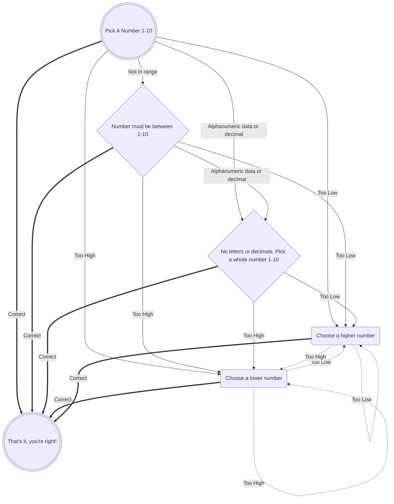

*A*) Starts the game  
*B*) If guess is correct, the game ends  
*C*) If a letter or decimal is entered, asks player to enter a whole number 1-10  
*D*) If guess is too low, choose a higher number  
*E*) If guess is too high, choose a lower number  
*F*) If guess is a number not in range, choose a number in range  
